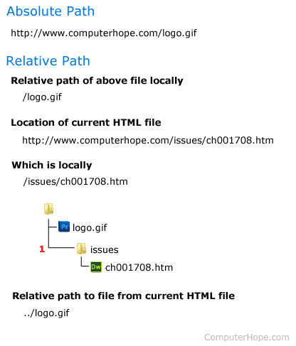

---

Title :  AbsolutePath__RelativePath
Subject : Absolute file Path and  Relative file Path
Author : Shyed Shahriar Housaini
Date : 07/07/2021
---

# What is the difference between a relative and absolute path?

When linking to a page or file on your site, knowing the difference between a relative path and absolute path is helpful. The following sections contain information on these differences for each of the major operating systems and how to appropriately link files to a web page. To proceed, choose your topic of interest from the following list.

## Path differences in Windows
### Windows absolute path
> C:\Windows\calc.exe

Windows non absolute path (relative path)

> calc.exe

In the example above, the absolute path contains the full path to the file and not only the file name as seen in the non absolute path. In this example, if you were in a directory that did not contain "calc.exe" you would get an error message. However, when using an absolute path you can be in any directory and the computer would know where to open the "calc.exe" file.

# How to find the absolute path in Windows
You can determine the absolute path of any file in Windows by right-clicking a file and then clicking Properties. In the file properties first look at the "Location:" which is the path to the file. In the picture below, the location is
 
> "c:\odesk\computer_hope". 

Next, add a backslash and then the file name to the end of the path. These actions would make the file example below have an absolute path of "

> c:\odesk\computer_hope\chrome.jpg".

## File properties with location path in Microsoft Windows

# How to find the absolute path in the Windows command line
From the Windows command line, you can find the absolute path of any file by looking at the current directory. For example, if your prompt was "C:\Windows>" and you wanted to know the absolute path of a calc.exe file in that directory, its absolute path is "c:\windows\calc.exe". In other words, the absolute path is the full directory path plus the file name.

Path differences in Linux
Linux absolute path
> /home/users/c/computerhope/public_html/cgi-bin
Linux relative path

> ./public_html/cgi-bin

In the example above, the absolute path contains the full path to the cgi-bin directory on that computer.

The relative path begins with a dot (period), representing the current directory (also called the "working directory"). The relative path ./public_html/cgi-bin is valid only if the current directory contains a path named public_html which contains a directory named cgi-bin.

# How to find the absolute path of a file in Linux
Since most users do not want to see the full path as their prompt, it is relative to their personal directory as shown above. To find the full absolute path of the current directory, use the pwd command.

Once you've determined the path to the current directory, the absolute path to the file is the path plus the name of the file. For example, if in the cgi-bin directory we had a file called "example.cgi," the absolute system path to the file is

> "/home/users/c/computerhope/public_html/cgi-bin/example.cgi".

# How to find the absolute path of a file in Linux for a web page
When working on a Linux computer used as a web server to show web pages on the Internet. It can be confusing to know what to use for the relative and absolute path. We've found that most of this confusion comes from not understanding that the root directory for your web page is the public_html directory.

In the absolute path example shown above, when linking files online, the absolute path would start with "public_html/" which would make the absolute path "public_html/cgi-bin" for the cgi-bin directory.

# Path differences in a web address
Internet URL absolute path
https://www.computerhope.com/oh.htm
Internet URL relative path
oh.htm
Finally, in this last example, the Internet absolute path is the domain and the web page on that domain. Web developers creating links to other pages can use a relative path if the file their linking from is in the same directory. See our URL definition for a full explanation of all the parts that make a URL.


# How to create a working relative path

Creating a path or URL to a file using the <a>, , or any other tag can be confusing. Creating a link to an absolute path is easy since you are pointing to the Internet URL of the file. For example, to link the Computer Hope logo (https://www.computerhope.com/logo.gif) the absolute path would be this URL as shown below.
```html
<a href="https://www.computerhope.com/cdn/media/logo-200-gray.png"></a>
```
However, to link to that same image file using a relative path, you must follow the steps below.

The file must exist on the same server as the HTML file. So, if we were linking to "logo-200-gray.png" that file must exist on the server or locally. You could also substitute the name of this file for any other file on your server.

The path to the file must be relative to the directory of the HTML file. So, if we wanted to link the "logo.gif" file on this page, the local path as "/issues/ch001708.htm" which is the "issues" directory containing this page. Since the "logo-200-gray.png" is in another directory, we'd need to go to the root directory and then the "cdn/media" directory to the file.

Now that we know the path to the file is back one directory and then in "cdn/media", we know the path is "../cdn/media/logo-200-gray.png"; the "../" tells the browser to go back one directory. If we needed to go back two directories, this would have to be done twice. The completed example is shown below.

```html
<a href="../cdn/media/logo-200-gray.png"></a```>
```

For those who are more visual or need a visual example, everything explained above is also shown in the picture below.

<!-- Images -->



# Absolute and relative path example.


HTML File Paths
A file path describes the location of a file in a web site's folder structure.

File Path Examples
Path	Description

```html

	The "picture.jpg" file is located in the same folder as the current page
	The "picture.jpg" file is located in the images folder in the current folder
	The "picture.jpg" file is located in the images folder at the root of the current web
	The "picture.jpg" file is located in the folder one level up from the current folder

```

## HTML File Paths

A file path describes the location of a file in a web site's folder structure.

File paths are used when linking to external files, like:

Web pages
Images
Style sheets
JavaScripts
Absolute File Paths
An absolute file path is the full URL to a file:

Example

```html


The  tag is explained in the chapter: HTML Images.
```


## Relative File Paths
A relative file path points to a file relative to the current page.

In the following example, the file path points to a file in the images folder located at the root of the current web:

Example
```html

```
In the following example, the file path points to a file in the images folder located in the current folder:

Example
```html

```
In the following example, the file path points to a file in the images folder located in the folder one level up from the current folder:

Example

```html

```
# Best Practice
> ## It is best practice to use relative file paths (if possible).

When using relative file paths, your web pages will not be bound to your current base URL. All links will work on your own computer (localhost) as well as on your current public domain and your future public domains.


[NTFS-Hard-Links-Junctions-and-Symbolic-Links.pdf](./NTFS-Hard-Links-Junctions-and-Symbolic-Links.pdf)